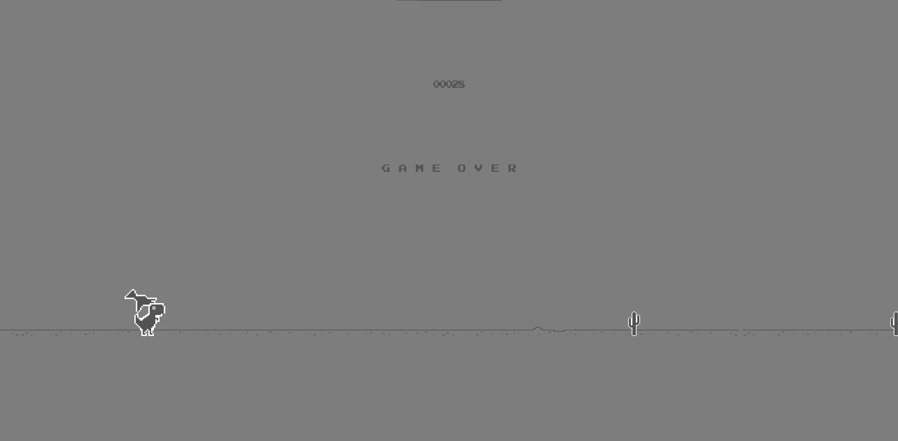

# Chrome Dino Remake

This is a remake of the popular Chrome Dino game, built using the cross-platform game engine Cocos2d-x. The game is designed to run on Windows platforms.

## Installation

To install the game, follow these steps:

1. Clone the repository to your local machine.
2. Open the project in Visual Studio Code.
3. Build the project using the CMake build system.
4. Run the game executable.

## Gameplay

The game is a simple side-scrolling platformer where the player controls a dinosaur character who must jump over obstacles and avoid incoming enemies. The game features a high score system and multiple levels of increasing difficulty.

## Contributing

Contributions to the project are welcome! If you find a bug or have a feature request, please open an issue on the project's GitHub repository. If you would like to contribute code, please fork the repository and submit a pull request.

## License

This project is licensed under the MIT License. See the LICENSE file for details.

## Credits

This project was built using the following open-source software:

- Cocos2d-x game engine
- Visual Studio Code IDE
- CMake build system

Thanks to the developers of these tools for making this project possible!

## Screenshots

